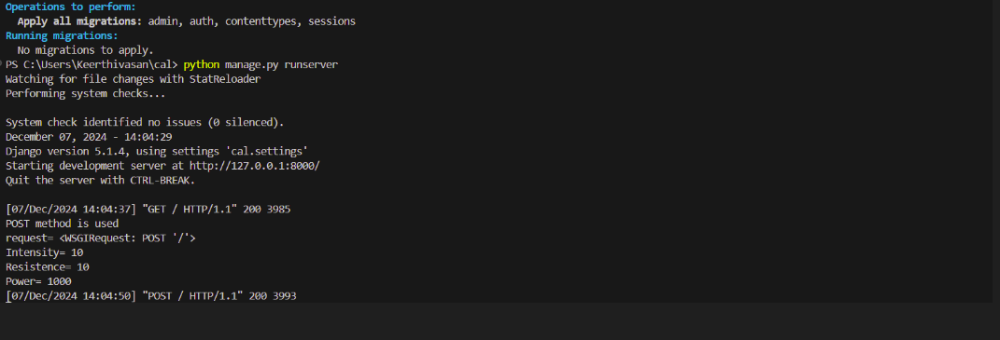
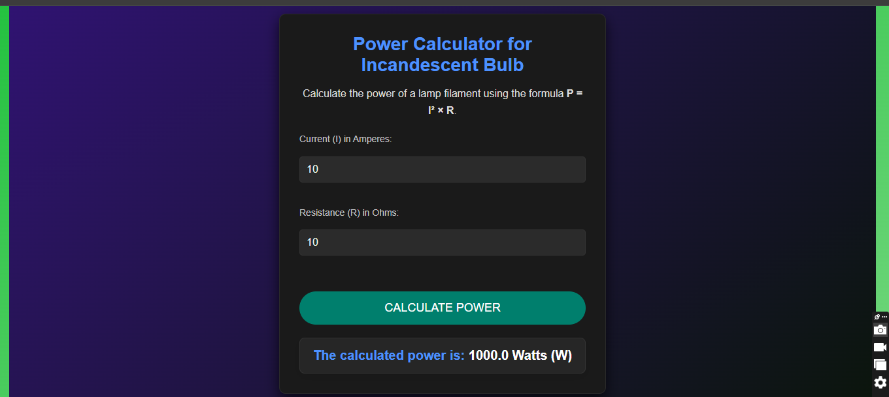

# Ex.05 Design a Website for Server Side Processing
# Date: 26/10/2024
# AIM:
To design a website to calculate the power of a lamp filament in an incandescent bulb in the server side.

# FORMULA:
P = I2R
P --> Power (in watts)
 I --> Intensity
 R --> Resistance

# DESIGN STEPS:
## Step 1:
Clone the repository from GitHub.

## Step 2:
Create Django Admin project.

## Step 3:
Create a New App under the Django Admin project.

## Step 4:
Create python programs for views and urls to perform server side processing.

## Step 5:
Create a HTML file to implement form based input and output.

## Step 6:
Publish the website in the given URL.

# PROGRAM :

# views.py:

    from django.shortcuts import render

    def calculate_power(request):
        context={}
        context['Power'] = ""
        context['I'] = ""
        context['R'] = ""
        if request.method == 'POST':
            print("POST method is used")
            I = request.POST.get('Intensity','')
            R = request.POST.get('Resistence','')
            print('request=',request)
            print('Intensity=',I)
            print('Resistence=',R)
            Power = int(I) * int(I) * int(R)
            context['Power'] = Power
            context['I'] = I
            context['R'] = R
            print('Power=',Power)
        return render(request,'bulb/calculate-power.html',context)

# urls.py:
    from django.urls import path
    from . import views

    urlpatterns = [
        path('calculate/', views.calculate_power, name='calculate_power'),
    ]

# settings.py:
    """
    Django settings for bulb_project project.

    Generated by 'django-admin startproject' using Django 5.1.3.

    For more information on this file, see
    https://docs.djangoproject.com/en/5.1/topics/settings/

    For the full list of settings and their values, see
    https://docs.djangoproject.com/en/5.1/ref/settings/
    """

    from pathlib import Path

    # Build paths inside the project like this: BASE_DIR / 'subdir'.
    BASE_DIR = Path(__file__).resolve().parent.parent

    # Quick-start development settings - unsuitable for production
    # See https://docs.djangoproject.com/en/5.1/howto/deployment/checklist/

    # SECURITY WARNING: keep the secret key used in production secret!
    SECRET_KEY = 'django-insecure-1k%i3gt+(5+$-&nyw1^z-#%e5#=aa__#hol4xx(z$t)!8c%!ub'

    # SECURITY WARNING: don't run with debug turned on in production!
    DEBUG = True

    ALLOWED_HOSTS = []

    # Application definition

    INSTALLED_APPS = [
        'django.contrib.admin',
        'django.contrib.auth',
        'django.contrib.contenttypes',
        'django.contrib.sessions',
        'django.contrib.messages',
        'django.contrib.staticfiles',
        'bulb',
    ]

    MIDDLEWARE = [
        'django.middleware.security.SecurityMiddleware',
        'django.contrib.sessions.middleware.SessionMiddleware',
        'django.middleware.common.CommonMiddleware',
        'django.middleware.csrf.CsrfViewMiddleware',
        'django.contrib.auth.middleware.AuthenticationMiddleware',
        'django.contrib.messages.middleware.MessageMiddleware',
        'django.middleware.clickjacking.XFrameOptionsMiddleware',
    ]

    ROOT_URLCONF = 'bulb_project.urls'

    TEMPLATES = [
        {
            'BACKEND': 'django.template.backends.django.DjangoTemplates',
            'DIRS': [],
            'APP_DIRS': True,
            'OPTIONS': {
                'context_processors': [
                    'django.template.context_processors.debug',
                    'django.template.context_processors.request',
                    'django.contrib.auth.context_processors.auth',
                    'django.contrib.messages.context_processors.messages',
                ],
            },
        },
    ]

    WSGI_APPLICATION = 'bulb_project.wsgi.application'

    # Database
    # https://docs.djangoproject.com/en/5.1/ref/settings/#databases

    DATABASES = {
        'default': {
            'ENGINE': 'django.db.backends.sqlite3',
            'NAME': BASE_DIR / 'db.sqlite3',
        }
    }

    # Password validation
    # https://docs.djangoproject.com/en/5.1/ref/settings/#auth-password-validators

    AUTH_PASSWORD_VALIDATORS = [
        {
            'NAME': 'django.contrib.auth.password_validation.UserAttributeSimilarityValidator',
        },
        {
            'NAME': 'django.contrib.auth.password_validation.MinimumLengthValidator',
        },
        {
            'NAME': 'django.contrib.auth.password_validation.CommonPasswordValidator',
        },
        {
            'NAME': 'django.contrib.auth.password_validation.NumericPasswordValidator',
        },
    ]

    # Internationalization
    # https://docs.djangoproject.com/en/5.1/topics/i18n/

    LANGUAGE_CODE = 'en-us'

    TIME_ZONE = 'UTC'

    USE_I18N = True

    USE_TZ = True

    # Static files (CSS, JavaScript, Images)
    # https://docs.djangoproject.com/en/5.1/howto/static-files/
    # Static files (CSS, JavaScript, Images)
    STATIC_URL = '/static/'

    # For development, use this to define where static files are stored
    STATICFILES_DIRS = [BASE_DIR / "static"]  # BASE_DIR is the root of your project

    # Default primary key field type
    # https://docs.djangoproject.com/en/5.1/ref/settings/#default-auto-field

    DEFAULT_AUTO_FIELD = 'django.db.models.BigAutoField'

# templates.html:

    
    <!DOCTYPE html>
    <html lang="en">
    <head>
        <meta charset="UTF-8">
        <meta name="viewport" content="width=device-width, initial-scale=1.0">
        <title>Power Calculator for Incandescent Bulb</title>
        <link rel="stylesheet" href="">
        
    </head>
    <body>
        

            

                

                    <h1>Power Calculator for Incandescent Bulb</h1>
                    
Calculate the power of a lamp filament using the formula <strong>P = I² × R</strong>.

                    <form method="POST">
                        
                        

                            {{ form.as_p }}
                        

                        <button type="submit" class="submit-button">Calculate Power</button>
                    </form>

                    
                        

                            <h3>The calculated power is: <strong>{{ power }} Watts (W)</strong></h3>
                        

                    
                

            

        

    </body>
    </html>

# SERVER SIDE PROCESSING:

# HOMEPAGE:

# RESULT:
The program for performing server side processing is completed successfully.
